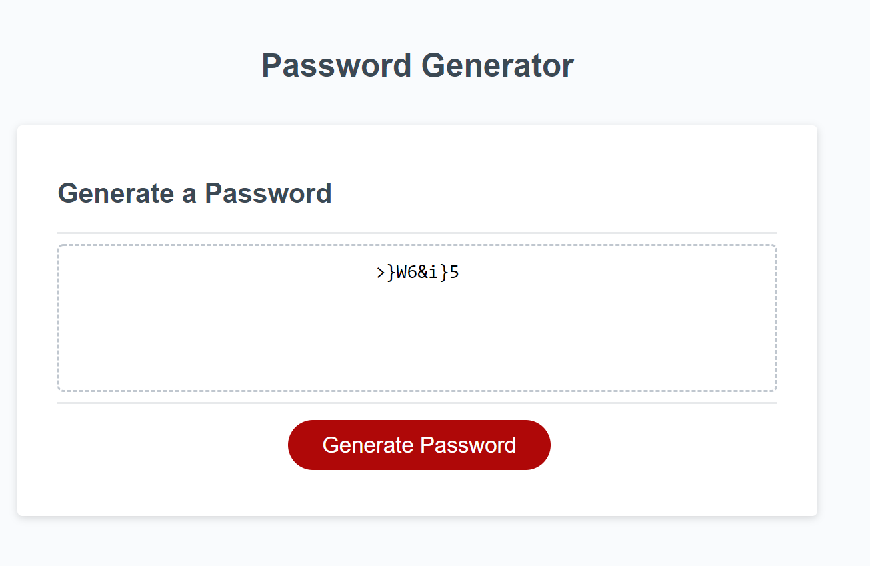

# Password Generator

* Prompt the user for length and character classes to use.  If these are valid, generate a random password and display it to the webpage.

## Deployment
This application is deployed at https://webgeekbear.github.io/password-generator/

## Screenshot
